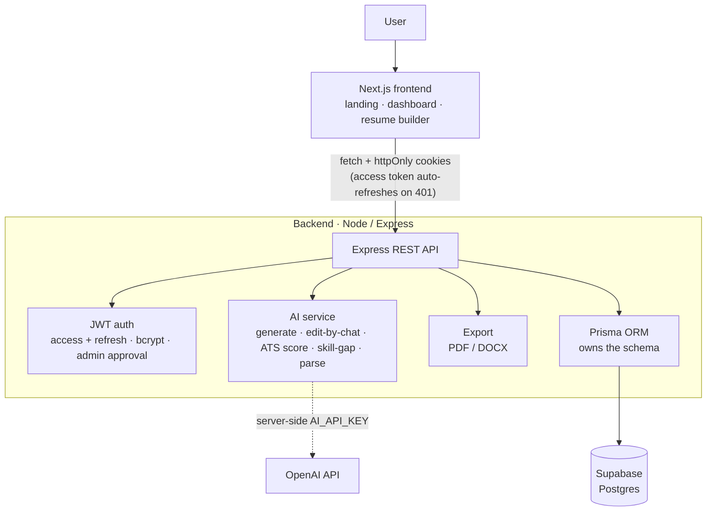

# Promp2Resume

**From prompt to polished résumé — in seconds.** An AI resume builder, ATS analyzer and job
application tracker. A senior-recruiter AI (13 yrs experience) writes, scores and tailors your
resume; you edit by chat, pick from 30 templates, download PDF/DOCX, and track every application.

🔗 **Live:** https://promp2resume.com

This is a monorepo with a clean **frontend / backend split**:

```
prompt2resume/
  backend/    Express + Prisma + JWT REST API  (owns the database)
  frontend/   Next.js app (brand, landing, dashboard, builder)
```

## Architecture



- **Backend** — Node/Express REST API. Prisma ORM owns the schema, so you set `DATABASE_URL`
  once and `npm run setup` creates every table automatically — **you never touch the Supabase SQL
  editor again.** Auth is JWT: short-lived access token + long-lived refresh token, both in
  httpOnly cookies, with bcrypt password hashing and admin approval.
- **Database** — your Supabase Postgres (just the database; no Supabase Auth, no manual SQL).
- **Frontend** — Next.js (App Router). Talks to the backend over `fetch` with credentials; the
  API client auto-refreshes the access token on 401. Promp2Resume brand kit: violet palette +
  gradient, Space Grotesk / Manrope / JetBrains Mono, animated buttons & text.

## Setup

### 1. Backend
```bash
cd backend
cp .env.example .env
# Fill DATABASE_URL + DIRECT_URL from Supabase → Settings → Database → Connection string (URI).
# Set the two JWT secrets and ADMIN_EMAIL / ADMIN_PASSWORD.
npm install
npm run setup        # prisma generate + db push (creates tables) + seed admin & promo codes
npm run dev          # API on http://localhost:4000
```

`npm run setup` is the magic step: it builds the whole schema in your Supabase database and seeds
your admin account + the `MUST@20` promo code. Re-run `npm run db:push` any time the schema changes.

### 2. Frontend
```bash
cd frontend
cp .env.example .env.local       # NEXT_PUBLIC_API_URL=http://localhost:4000
npm install
npm run dev                      # app on http://localhost:3000
```

Open http://localhost:3000, click **Get started**, register, then log in with your seeded admin
(`ADMIN_EMAIL` / `ADMIN_PASSWORD`). Approve other users from the **Admin** page. The AI uses the
server's `AI_API_KEY` (set it in `backend/.env`) — users never supply a key.

## Features
Prompt→resume generation · edit-by-chat · 30 templates + gallery · transparent ATS score ·
skill-gap analysis with learning plan & project ideas · PDF/DOCX export · 3 free downloads/day +
`MUST@20` unlock · resume versions · dashboard of past resumes · job tracker (auto-log on download) ·
admin (approve users, limits, plans, promo codes) · Free/Pro pricing ($30 / 100 resumes — payment stubbed).

## Backend API (summary)
`POST /api/auth/{register,login,refresh,logout}` · `GET/PUT /api/auth/me` ·
`POST /api/ai/{generate,edit,section,ats,skills,parse}` · `CRUD /api/resumes` + `/:id/versions` ·
`POST /api/download` · `CRUD /api/tracker` · `POST /api/promo/redeem` · `/api/admin/{users,promo}`.

## Tests
```bash
cd backend && npm test       # ATS scoring, PDF/DOCX export, JWT roundtrip, template rendering
```

## Production notes
- Set `NODE_ENV=production` (enables `secure` cookies — serve over HTTPS).
- Put the frontend and backend on the same site/subdomains so the auth cookies flow; update
  `FRONTEND_URL` (backend CORS) and `NEXT_PUBLIC_API_URL` (frontend) accordingly.
- Payments (Stripe) and Supabase Storage archival are intentionally left as next steps.
